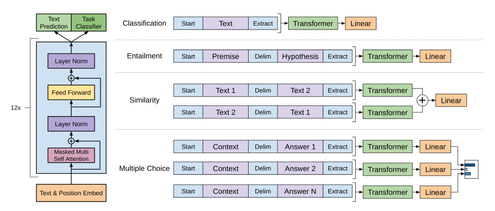

# Abstract

自然语言理解包含广泛多样性任务，比如文本蕴含，问答，语义相似度评估，文本分类。然而没有标注的文本语料是非常丰富的，而这些特定任务有标注的数据太少，怎么利用这些丰富的无标记数据训练模型是非常有挑战性的。我们论证了通过在未标注的丰富数据集上生成预训练语言模型，然后在每个指定任务上进行fine-tuning，可以在这些任务中获得巨大的收益。对比之前的方法，我们在fine-tuning的时候使用面向任务的输入转换来达到高效的迁移，仅仅需要最小的模型架构的修改。我们在广泛的自然语言理解的benchmarks上论证了我们方法的有效性。我们通用的不针对任务的模型显著超越了那些针对每个任务精心设计的模型，在12个任务中有9个达到了SOTA。比如，我们在知识推理上达到了8.9%的绝对提升(Stories Cloze Test)，问答上提升5.7%（RACE），文本蕴含提升1.5%（MultiNLI）。

# 一、Introduction

在NLP中，如何有效地从无标记的原始文本中学习，对于减轻监督学习的依赖至关重要。大部分深度学习的方法需要大量的手工标记的数据，这限制他们在许多缺乏标注数据的领域的适用性。在这样的情况下，模型能够从无标记数据中学习语言信息，为收集更多标注数据提供了一个有价值的替代方法，标注数据既花钱又耗时。即便是那些有大量标注数据的场景，通过无监督的方式从丰富的语料学习一个好的语言表示也能提供一个显著的提升。最有说服力的证据就是到目前为止各种被广泛应用的word Embeddings(word2vec, GloVe )，提升了广泛下游NLP任务的性能。

从无标注文本中利用词级别以外的信息非常具有挑战性，有2个主要的原因。首先，在学习对迁移有用的文本表示时，哪种类型的优化目标最有效尚不清楚。近期的研究做过各种不同的目标，比如语言模型，机器翻译，语句一致性，基于每一种方法在不同任务上都超过了其他方法。第二，对于如何将学习到的表征转化为目标任务，目前还没有达成共识。现有的技术包括对模型体系结构进行特定于任务的更改，使用复杂的学习方案[21]和添加辅助学习目标。这些不确定性使得开发有效的语言处理半监督学习方法变得困难。

在本文中，我们探索了一种半监督的语言理解任务方法，使用无监督的预训练和监督的微调相结合。我们的目标是学习一个全局的表示，做简单的适配来迁移到各种各样的任务上。我们假定可以访问大量的未标注文本语料和一些有手工标记的训练样本的数据集。我们的设定不需要这些目标任务和未标记的语料在相同的领域。采用2段式的训练过程。首先，我们使用LM(语言模型)为目标在未标注的数据上使用神经网络来学习一个初始的参数表示。接下来，我们基于特定任务的监督目标来调整这些参数。

我们的模型架构使用Transformer，已经被证明在不同的任务上有很强的表现，比如机器翻译，文本生成，句法解析。这个模型结构为我们提供了更结构化的内存来处理文本中的长依赖，与传统的循环神经网络相比，在多种任务中表现出了更强的迁移能力。在迁移过程中，我们利用任务特定的派生自traversal-style方法输入改写，将结构化文本输入当做一个连续的tokens序列。我们在实验中证明这样的改写能高效的fine-tuning，对预训练模型的结构进行最小的改变。

我们在4种类型的自然语言理解任务(NLU)上评估我们的方法：自然语言推断(NLI)，问答，语义相似性和文本分类。我们通用的不针对任务的模型显著超越了那些针对每个任务精心设计的模型，在12个任务中有9个达到了SOTA。比如，我们在知识推理上达到了8.9%的绝对提升(Stories Cloze Test)，问答上提升5.7%（RACE），文本蕴含提升1.5%（MultiNLI），在最近引入的GLUE多任务benchmark上提升5.5%。我们也分析了预训练模型在4个不同设置下的zero-shot行为，来证明它确实为下游任务获取了有效的语言知识。

# 二、related work

**NLP的半监督学习** 我们的工作广义上属于NLP半监督学习。这种模式引起人们的广泛注意，包括序列标注，文本分类。最早的方法使用无标记的数据来计算词级别和段落级别的统计信息，然后当做特征应用到有监督模型中。过去几年，研究者们论证了使用word embeddings的的作用，它使用未标记的语料进行训练，提升广泛的下游任务的性能。这些方法仍然迁移词级别的信息，然而我们的目标是捕获更高级别的语义。

近期的方法已经调研了从未标记的数据中学习和使用比词级别更多的语义。段落或者句子级别的embeddings，可以使用未标记的语料，已经被用来编码文本到合适的向量表示进行多样的目标任务。

**无监督预训练** 无监督预训练是半监督学习的一种特殊情况，其目标是找到一个良好的初始点，而不是修改监督学习目标。早期的研究探索了该技术在图像分类[20,49,63]和回归任务[3]中的应用。随后的研究[15]表明，预训练作为一种正则化方案，能够在深层神经网络中实现更好的泛化。在最近的工作中，该方法已被用于帮助在各种任务上训练深层神经网络，如图像分类[69]、语音识别[68]、实体消歧[17]和机器翻译[48]。 

与我们的工作最接近的是使用语言模型的目标来预训练一个神经网络，然后在目标任务上使用监督的方式进行fine-tuning。Dai和Howard，Ruder通过这样的方法来改进文本分类。然而尽管预训练阶段帮助我们捕获了一些语言信息，他们使用的LSTM模型使得预测受限于短距离。相对来说，我们的实验中论证了选择Transformer网络来帮助我们捕获更大范围的语言结构。更进一步，我们也论证了我们的模型在广泛的任务上更有效，包括自然语言推断，篇章检测和故事续写。其他的方法使用预训练语言或者机器翻译模型的隐藏层表示来辅助特征，在目标任务上训练一个有监督的模型。这会为每一个单独的目标任务引入大量的新参数，但是在迁移的时候我们需要的是最小化修改模型结构。

**辅助的训练目标** 添加一个辅助的无监督训练目标是半监督学习的另一种形式。Collobert和Weton早期的工作使用广泛的辅助 NLP任务比如POS tagging，chunking，NER，语言模型来改进语义角色标记。最近Rei添加了一个辅助的语言模型目标到他们的目标任务，论证了能提升序列标注任务的性能。我们的实验也使用辅助目标，但是正如我们呈现的，无监督预训练已经学习了一些目标任务相关的语言方法。

# 三、框架

我们的训练过程由2部分组成。第一步从大的语料库中学习一个高容量的语言模型。接着进行一个fine-tuning的阶段，我们使用标记数据调整模型完成下游任务。

## 3.1 无监督的预训练

给定一个非监督的语料tokens U = {u1, . . . , un}，我们使用一个标准的语言模型目标（计算句子U出现的概率）来最大化下面的似然函数：
$$
L_1(U) =\sum_{i}logP(u_i|u_{i−k}, . . . , u_{i−1}; Θ)
$$
k是上下文的窗口的大小，使用神经网络的参数Θ来建模条件概率P。这些参数使用随机梯度下降来学习。

在我们的实验中，我们使用多层**Transformer decoder的语言模型**，是Transformer的变种。模型在输入上下文tokens上使用一个多头自注意力机制的操作，接一个位置相关的前向网络层，产生一个目标tokens的输出分布：
$$
h_0 = UW_e + W_p\\
h_l = transformer\_block(h_{l−1})∀i ∈ [1, n]\\
P (u) = softmax(h_nW^T_e )
$$
其中U = (u−k, . . . , u−1)是tokens的上下文向量，n是层数，We是token的embedding矩阵，Wp是位置的embedding矩阵

> 我的理解是，U是当前token之前窗口为k的长度的token，We为当前token的embedding，Wp为当前token的位置向量。
>
> 算得h0后，经过n个transformer块，得到hn，hn和We的转置做矩阵乘法后的结果经过softmax，得到预测的token的概率分布。

## 3.2 监督的微调

训练完预训练模型以后，我们基于有监督目标任务对参数进行微调。我们假设一个有标记的数据集C，每一个实例由输入tokens的序列组成，x~1~, . . . , x~m~ ，标签是y。这些输入通过我们的预训练模型，获取最后一个Transformer块的输出$h^m_l$ 接着输入到一个新增的线性输出层 W~y~来预测y：
$$
P(y|x^1,...,x^m) = softmax(h^m_l W_y).
$$

我们最大化下面的目标
$$
L_2(C) =\sum_{(x,y)} log P (y|x^1, . . . , x^m).
$$

> 和预训练区别的是，预训练是计算某个句子出现的概率。而微调是文本分类，给一些token，预测出一个分类。

我们还发现加入语言模型当做辅助目标进行fine-tuning有助于学习 (a) 提升监督模型的泛化能力 (b) 加速收敛。这跟之前的工作一样，观察了使用这样一个辅助能提升性能。特别是，我们优化以后目标：
$$
L3(C) = L2(C) + λ ∗ L1(C)
$$
这里使用的 ![[公式]](https://www.zhihu.com/equation?tex=L_%7B1%7D) 还是之前语言模型的损失（似然），但是使用的数据不是前面无监督的数据 ![[公式]](https://www.zhihu.com/equation?tex=U) ，而是使用当前任务的数据 ![[公式]](https://www.zhihu.com/equation?tex=C) ，而且只使用其中的 ![[公式]](https://www.zhihu.com/equation?tex=X) ，而不需要标签y。

整体上，我们需要的额外参数只有fine-tuning阶段的Wyc，以及分隔符的embedding。

## 3.3 特定任务的输入转换

针对不同任务，需要简单修改下输入数据的格式，例如对于相似度计算或问答，输入是两个序列，为了能够使用 GPT，我们需要一些特殊的技巧把两个输入序列变成一个输入序列，如下图，可以发现，对这些任务的微调主要是新增线性层的参数以及起始符、结束符和分隔符三种特殊符号的向量参数.

- Classification：对于分类问题，不需要做什么修改
- 文本蕴涵（Entailment）：对于文本蕴涵任务，作者用一个“$”符号将文本和假设进行拼接，并在拼接后的文本前后加入开始符“start”和结束符“end”，然后将拼接后的文本直接传入预训练的语言模型，在模型再接一层线性变换和softmax即可。
- 文本相似度（Similarity）：对于文本相似度任务，由于相似度不需要考虑两个句子的顺序关系，因此，为了反映这一点，作者将两个句子分别与另一个句子进行拼接，中间用\$进行隔开，并且前后还是加上起始和结束符，然后分别将拼接后的两个长句子传入Transformer，最后分别得到两个句子的向量 ![[公式]](https://www.zhihu.com/equation?tex=h_%7Bl%7D%5E%7Bm%7D) ，将这两个向量进行元素相加，然后再接如线性层和softmax层。
- Multiple-Choice：对于问答和常识推理任务，首先将背景信息与问题进行拼接，然后再将拼接后的文本依次与每个答案进行拼接，最后依次传入Transformer模型，最后接一层线性层得多每个输入的预测值。

# 六、结论

我们介绍了一个框架，单个非面向任务模型，通过生成预训练和fine-tuning，在自然语言理解上达到了很强的能力。通过在多样性的语料，长依赖连续文本进行预训练，我们的模型获取了重要的全局知识，有能力处理长距离的依赖，然后成功的进行迁移解决了不同的区分任务，比如问答，语义相似度判断，文本蕴含和文本分类，提升了我们研究的12个数据集中的9个的SOTA结果。使用非监督的预训练来提升区分性任务的性能，一直是机器学习研究的一个重要目标。我们的工作表明达到显著的提升是有可能的，并且提供了提示，什么样的模型(基于Transformer)和数据集(有长距离依赖的文本)在这种方式下工作的最好。我们希望这能有助于无监督的新的研究，包括自然语言理解和其他领域，进一步提升我们对于无监督学习怎么用和何时用的理解。

# 和bert的部分异同

同：

1. 方便的两阶段式模型，都是以Transformer为主题架构先预训练一个通用的模型，然后在各个子任务上进行微调，减少了传统方法需要针对各个任务定制设计模型的麻烦。

不同：

1. 预训练：bert可以看上下文，而gpt是单向的。GPT 预训练的方式和传统的语言模型一样，通过上文，预测下一个单词；bert预训练的方式是使用 Mask LM，可以同时通过上文和下文预测单词。例如给定一个句子 ![[公式]](https://www.zhihu.com/equation?tex=u_%7B1%7D%2Cu_%7B2%7D%2C...%2Cu_%7Bn%7D) ，GPT在预测单词 ![[公式]](https://www.zhihu.com/equation?tex=u_%7Bi%7D) 的时候只会利用 ![[公式]](https://www.zhihu.com/equation?tex=u_%7B1%7D%2Cu_%7B2%7D%2C...u_%7Bi-1%7D) 的信息。而BERT会同时利用 ![[公式]](https://www.zhihu.com/equation?tex=u_%7B1%7D%2Cu_%7B2%7D%2C...%2Cu_%7Bi-1%7D%2Cu_%7Bi%2B1%7D%2C...%2Cu_%7Bn%7D) 的信息。
2. 应用：GPT 因为采用了传统语言模型所以更加适合用于自然语言生成类的任务 (NLG)，因为这些任务通常是根据当前信息生成下一刻的信息。而 BERT 更适合用于自然语言理解任务 (NLU)。
3. 模型结构： GPT 采用了 Transformer 的 Decoder，而 BERT 采用了 Transformer 的 Encoder。GPT 使用 Decoder 中的 Mask Multi-Head Attention 结构，在使用 ![[公式]](https://www.zhihu.com/equation?tex=u_%7B1%7D%2Cu_%7B2%7D%2C..%2Cu_%7Bi-1%7D) 预测单词 ![[公式]](https://www.zhihu.com/equation?tex=u_%7Bi%7D) 的时候，会将 ![[公式]](https://www.zhihu.com/equation?tex=u_%7Bi%7D) 之后的单词 Mask 掉。