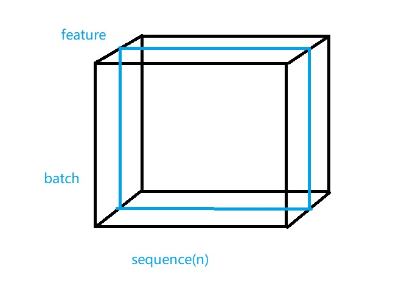
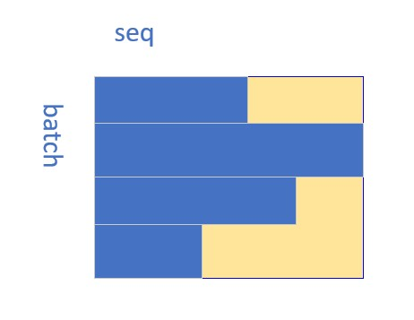
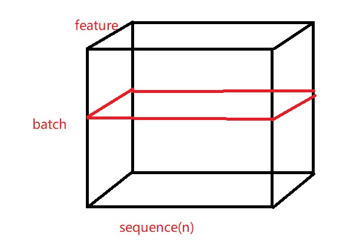
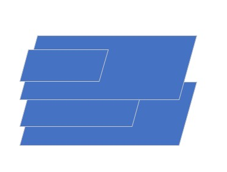
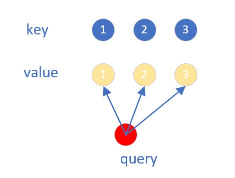
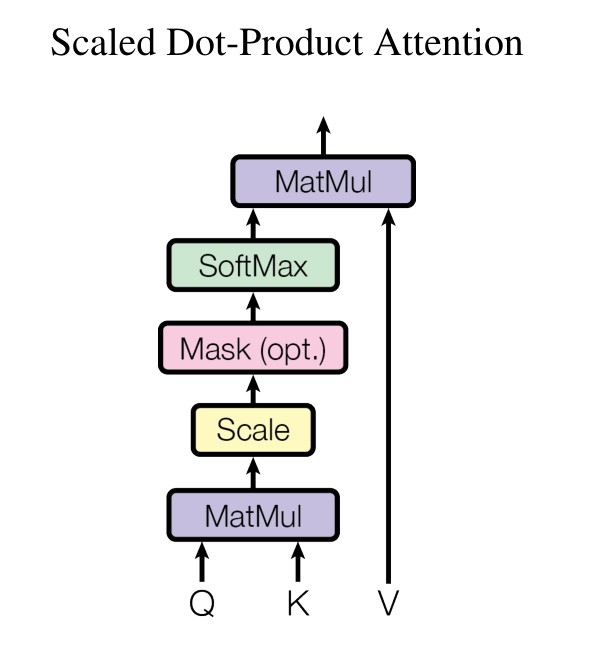
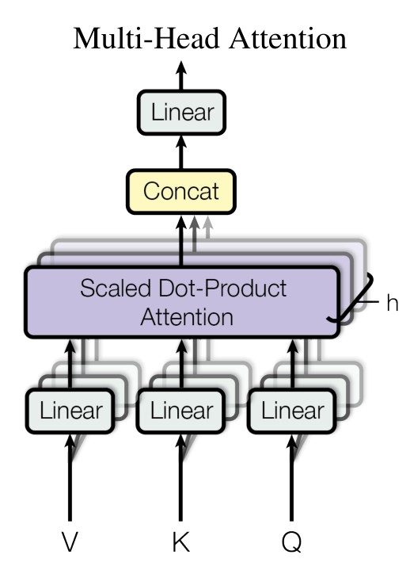

# abstract

1. 主流的序列转录模型通常是基于负载的循环或者卷积神经网络，包含了一个encoder和decoder。
2.  性能比较好的模型，使用了注意力机制连接了encoder和decoder
3. 我们提出了一个新的简单的架构，transformer，仅仅依赖于注意力机制，没有依赖循环和卷积
4. 在机器翻译上做了两个实验，效果更好，可以并行处理并且需要更少的时间。
5. 我们的模型在英语to德语的翻译任务上达到了28.4BLEU，超过了当前最好结果2BLEU。
6. 在英语to法语也好
7. 我们通过将Transformer成功地应用于具有大量和有限训练数据的英语分组解析，表明它可以很好地推广到其他任务。

> 它一开始是用于机器翻译的，后来被应用在很多领域

# 一、Introduction

1. 在时序模型中当前（2017年）最常用的包括RNN,LSTm,GRU。
2. 有两个主流的模型：语言模型、编码器-解码器架构

RNN中，从左到右一个一个读的，对于ht由ht-1和当前输入决定。难以并行。如果时序比较长，在后面的时候容易丢掉前面的信息。

attention在RNN上的应用。attention有应用在encoder-decoder上，是搭配RNN一起使用。

1. transformer不再使用循环神经层，而是纯基于attention，可以并行运算。

# 二、背景

用卷积神经网络替换循环神经网络的相关工作。但是用卷积神经网络难以对比较长的序列建模。卷积在做计算时，每次只看比较小的窗口，需要叠加很多层才能融合间隔比较远的像素点之间的信息。但是使用transformer里面的注意力机制，可以一次看见所有的信息，用一层就行。但是卷积比较好的地方是可以做多个输出通道，一个输出通道可以理解为识别不一样的模式。于是提出了multi-head attention（多头注意力机制）来模拟卷积神经网络多输出通道。

自注意力机制相关介绍。

memory network 跳过。

# 三、模型架构

1. 序列模型中，比较好的是编码器-解码器架构

2. 编码器，将每个输入X（长度为n的序列），输出对应的向量的表示Z（长度为n）。

3. 解码器，将Z作为输入，然后一个一个的生成一个序列Y（y1,...ym）。

4. 在每个步骤中，模型都是auto-regressive自回归的，在生成下一个步骤时，使用之前生成的符号作为额外的输入。

   > 解码器中，在生成yt时，需要将yt-1,yt-2....都作为输入。

1. Transformer使用了编码器-解码器架构，将self-attention、point-wise、全连接层堆叠在一起。分别如下图的左、右两部分所示

## 3.1 编码器-解码器

**编码器**：

1. 使用了N=6的完全一样的层。

2. 每一层有两个子层。

3. 第一个子层叫做multi-head self-attention，第二个子层是一个MLP（position-wise fully connected feed-forward network）

4. 每一个子层用了一个残差连接，再使用一个layer normalization。

5. 也就是说每一个子层的输出为`LayerNorm(x+ Sublayer(x))` 。

   > 输入x先经过子层后的输出，在和输入x相加，作为LayerNorm的输入。

6. 残差网络的输入和输出需要是同样的维度。为了方便计算，每个字符的输出都是512维的向量。

**解码器**：

1. 使用了N=6的完全一样的层。

2. 除了和编码器中一样的两个子层外，还有第三个子层，采用了多头注意力机制。
3. 和编码器相同，对每个子层采用了残差连接和layernorm
4. 修改了自注意机制，以避免预测时看见后面的内容。
5. 在一个子层中使用了masked的方法来实现。

**batchnorm和layernorm**

> 对于一个二维的向量：
>
> - batchnorm:取每一个feature（对应图上每一列），算他们的平均值和标准差，将其转换成平均值为0，方差为1的数。需要全局存某feature的平均值和方差，会随着batch不同，读到不同的数而变化。
>
> 
>
> - layernorm:对每个batch做归一化。不需要额外记录。
>
> 
>
> 对于一个三维的向量：seq表示不同的序列，每个序列里有多个词。
>
> - batchnorm:针对的还是同一个feature,取下图这样一个横切面
>
> 
>
> 不同的sequence长度是不一样的，所以对于某feature，横截面如下图。空白的地方会以0补齐。这时计算整个蓝色区域的平均值和标准差，然后将其归一化。
>
> 
>
> - layernorm：针对每个batch，取如图的横截面。
>
> 
>
> 最后得到这种大小不一的横截面，同样，计算这个横截面的平均值和方差即可，不需要记录额外的数据。
>
> 

## 3.2 Attention

1. 注意力函数是将一个query和一个key-value对 映射成一个输出的函数。其中query、key、value和输出都是向量。
2. output是value的加权和，其中权重是key和query的相似度计算得到的。

> 例如q和k1比较像，那么最后的output中value1的权重会比其他的更大。
>
> 

### 3.2.1 Scaled Dot-Product Attention

1. attention中采用了Scaled Dot-Product Attention。是一种很简单的attention。

2. query和key都是dk维的，value是dv维度，则输出也是dv维。

3. 我们计算query和每个key的内积，然后每一个再除以 √ dk（key的长度），最后使用softmax获得每个key对应的权重。

1. 在实际运算中，将query、key、value都用向量的形式表示为Q、K、V。这样就可以用并行计算了。
2. 其中Q为n×d~k~, K为m×dk，V为m×dv。最终得到一个n×dv的向量，每一行就是要的输出了
3. 则计算公式如公式(1)所示。

$$
Attention(Q, K, V ) = softmax(\frac{QK^T}{\sqrt{d_k}})V
$$

1. 一般有两种比较常见的注意力机制：加型的注意力机制，它可以处理query和key不等长的情况。还有一种是点积的注意力机制，除了没有除以 √ dk之外，它和作者的方式一样。
2. 这两种方式差不多，作者选用了点积的方式，是因为矩阵乘法算起来方便。
3. 除以√ dk的原因是：当k不是很大的时候，除不除没有关系；但是当dk比较大的时候，做点积的值可能会很大。这样得到的结果之间的差距会很大，值向两端靠拢。出现这样的情况时，计算梯度，梯度会变小，跑不动

> scaled点积的步骤如下图
>
> 
>
> 1. Q和K做矩阵乘法
> 2. 除以 √ dk
> 3. 选择是否屏蔽
> 4. 进行softmax得到权重
> 5. 和V做矩阵乘法
>
> 
>
> **mask**的方法：
>
> 进行上述步骤1和2后，对于t及之后的数值替换为一个极小的值（例如1×e^-10^），这样在经过softmax之后，权重会变为0。

### 3.2.2 Multi-Head Attention

对于V、K、Q，先通过一个线性层，将他们投影到一个低维度的，然后再进行scaled dot-product attention。这样进行h次后，得到的结果连接在一起，再做一次投影回到原来的维度。

计算公式为：
$$
MultiHead(Q, K, V ) = Concat(head1, ..., headh)W^O
$$

$$
where  \quad headi = Attention(QW^Q_i, KW^K_i, VW^V_i)
$$

transformer中h=8，512/8=64，所以每次将他投影到64维上

### 3.2.3 application of attention in our model

transformer运用多头注意力机制在三个不同的方面：

- 在编码器中，输入（词元经过embedding后加上位置信息得到的一个512维的向量）复制成三个，作为K、Q、V，然后进行多头attention，输出的结果维度和输入相同。对于某一个向量，因为和自己最相似，所以自己的那一个v的权重最大。
- 解码器中的第一个，添加了masked。其余和编码器一样。（输入为上一次decoder的输出。比如开始的输入为SOS（start of sentence）,然后它自己做attention，生成Q再进入到第二个attention中；第二次为刚刚生成的字，那么就是两个词做attention，生成Q）
- 解码器中的第二个，K、V来自编码器的输出，Q来自解码器上一层的输出。编码器和解码器的交互就在这里。

## 3.3 Position-wise Feed-Forward Networks

它就是一个两层的全连接层，中间隐藏层将其扩大到2048维，然后再回到512维。

计算公式为
$$
FFN(x) = max(0, xW_1 + b_1)W_2 + b_2 
$$

> **为什么要加这一层**，参考https://blog.csdn.net/weixin_42399993/article/details/121585747中提到，在attention内部主要做的是线性变换，而非线性变换的学习能力更强。通过激活函数的方式，来强化representation的表达能力。在全连接层中，先将数据映射到高维空间，再映射到低维空间的过程，可以学习到更加抽象的特征。
>
> **它在transformer和RNN中的区别**：
>
> 在transformer中，它可以对单个的attention输出同时作用，因为这一个输出包含了所有的序列信息。
>
> 在RNN中，它只能一个一个地、按照顺序对每个点作用。它将上一个时刻的输出，和这个时刻的输入同时作为输入。

## 3.4 embeddings and softmax

embeddings 将input tokens和output tokens映射成512维的向量。

softmax将decoder的output映射成token。

## 3.5 Positional Encoding

对于transformer，如果没有位置信息，那么不管输入的位置是怎样的，输出都是一样的。所以需要加入时序信息。>RNN将上一个输出作为当前时刻的输入，来获得时序信息。

transformer在输入中添加时序信息。通过公式5计算出一个数字的512维向量表示，再用它和embedding结果相加
$$
P E(pos,2i) = sin(pos/10000^{2i})/d_{model})\\
P E(pos,2i+1) = cos(pos/10000^{2i}/d_{model})
$$

# 五、实验

# 七、结论

1. 我们提出了transformer，第一个仅仅依赖于注意力机制的序列转录模型，使用multi-head self-attention的encoder-decoder架构代替了最常使用的循环层。

1. 对于翻译任务，transform对比其他基于循环和卷积神经网络的快很多。
2. 在WMT 2014英语到德语和WMT 2014英语到法语的翻译任务中，我们都达到了一个新的水平。在前一个任务中，我们的最佳模型甚至优于所有之前报告的集合。

1. 我们很兴奋未来将基于注意力机制的模型用在其他的任务上
2. 我们计划将Transformer扩展到涉及文本以外的输入和输出模式的问题，并研究局部受限的注意力机制，以有效地处理图像、音频和视频等大型输入和输出。
3. 生成更少的序列是我们的另一个研究目标。